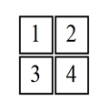

# 视频的播放与显示

## 基本概念

### 帧率定义

**每秒闪过的帧数称为帧率**  
`FPS`: `frame pre second`  
一帧一帧切换构成了一个完整视频  

### 荧光粉与场编码
早期电视通过阳极轰炸阴电子到屏幕的荧光粉上进行图像展示  
电子束在磁场作用下，一行一行的进行扫描
奇数行扫完扫描偶数行  
整个扫描完一次，称为**一场**
**由于一场只能扫一半，因此2场才能呈现完整的一帧**
目前VESA标准下，荧光粉屏幕的最新刷新速率标准是 85HZ 这样才能没有明显的闪烁感  

### LED 液晶显示器
LED也就是液晶显示器，基本单元也是像素  
同样需要一行一行的刷新显示  
常见的刷新频率是 60HZ，现在高刷做到了 120HZ  
**液晶本身是不会发光的，需要背光源**  
现在的 OLED 技术可以不用背光源，直接发光
  
### 分辨率
**1080P: (1920 * 1080) 个像素**
`P` 一般指逐行扫描
也有 `1080i` 一说  
`i` 代表各行扫描，和那个荧光粉显示器逻辑差不多 2场 呈现一帧  
`1920 * 1080 * 3 / 1024 = 6075 Kb/frame`
3代表 3字节，3字节正好用来存放 RGB 的 24 位
一帧就需要 `6MB` 左右！
一般一个视频 `25fps`，那么 一秒就需要传输 将近 `25 * 6MB = 150MB` 数据

 

## 视频压缩  

### 简单逻辑
1. 针对人眼不敏感的颜色进行有损压缩  
2. 运动预测，两帧图片只存储差异信息，不存储全部信息  

经过压缩的1080P视频往往只需要 2MB ~ 4MB 的带宽

## FourCC

FourCC 通俗来讲指4字节编码  

2*2 像素示意图：

### YUV 色彩表示

YUV 色彩表示是视频编码中常见的色彩格式  
诞生于 黑白电视到彩电的过渡阶段  
黑白电视只使用Y平面  
**`U` `V`有时也被称为`Cb` 与 `Cr` 分别表示蓝色与红色的亮度差**
`YUV = YCbCr` 

#### YUV444

`YUV444` 代表水平每4个像素中，YUV各取4个字节，也就是说每个像素都分别有
`YUV`对应的一个字节，共占用 `1+1+1 * 8（位）/ 1pix = 24bpp (bit per piex)`
一帧图像占用的存储空间为 `24bpp * 1920 * 1080 = 49766400 bit / 8 = 6200800 字节`
 - 像素存储：`Y1U1V1Y2U2V2Y3U3V3`
 - 平面存储：`Y1Y2Y3U1U2U3V1V2V3`

#### YUV422  

含义：水平每2个像素与垂直每2个像素 Y取2个字节，U取1个字节，V取一个字节  
平均每个像素下，`(2+1+1) * 8 / 2 = 16bpp(bit per piex)`  
该格式对应的 `FourCC` 代码有`YUYV`、`YVYU`、`UYVY`、`VYUY` 等
对于 2*2像素 YUYV = `Y1U1Y2V2Y3U3Y4V4`
相比 `YUV444` 能节省 4字节的存储空间

#### YUV411

含义：水平每4个像素中，Y取4个字节，U取一个字节，V取一个字节
`(4+1+1) * 8 / 4 = 12 bpp`

### YUV420

含义：水平每2个像素与垂直每2个像素，U取2个或0个字节，V取2个或0个字节  
第一行：Y2U2V0，下一行：Y2U0V2 类似这样的编排
2:1的水平取样，垂直2:1采样  
在奇偶交错中，呈现 Y4U2V0 与 Y4U0V2 的排列  

